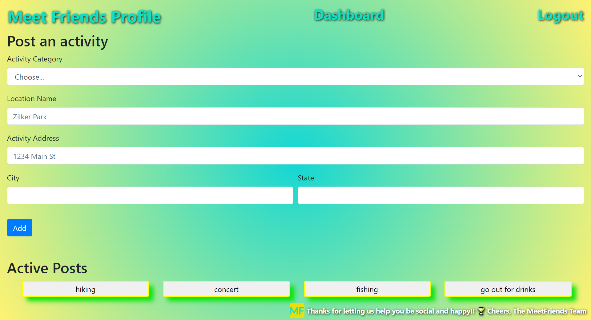

# **MeetFriends**

## **Description**
The purpose of this project was to build a full-stack web application that would solve the "real-world problem" of helping to reduce social isolation as a result of the COVID-19 pandemic by connecting people with each other around shared interests. 

 

## **Table of Contents**
[User Story](#user-story) 
[Acceptance Criteria](#acceptance-criteria) 
[Contributing](#contributing) 
[Built With](#built-with) 
[Sample Screen Shots](#sample-screen-shots) 
[Deliverables](#deliverables) 
 

 

### **User Story**
AS A USER that wishes to be more social and make more friends 
I WANT to meet new people and enjoy an activity with them 
SO THAT I can feel less isolated 

### **Acceptance Criteria**
- Use Node.js and Express.js to create a RESTful API
- Use Handlebars.js as the templating engine
- Use MySQL and the Sequelize ORM for the database
- Have both GET and POST routes for retrieving and adding new data
- Be deployed using Heroku (with data)
- Use at least one new library, package, or technology
- Have a polished UI
- Be responsive
- Be interactive (i.e., accept and respond to user input)
- Have a folder structure that meets the MVC paradigm
- Include authentication (express-session and cookies)
- Protect API keys and sensitive information with environment variables
- Have a clean repository that meets quality coding standards
- Have a quality README 

### **Contributing**
The following individuals contributed to this project (listed in alphabetical order by last name): 
Sapana Donde - Back End 
Daniel Escobedo - Front End 
Scott Heier - Front End and Back End 
Hector Mendez - Front End 
Andrea West - Front End and Back End 

### **Built With**
* Bcrypt
* Bootstrap
* Dotenv
* Express.js
* Handlebars
* Multer
* MySQL
* Node.js
* Sequelize

### **Sample Screen Shots**
(1) The following screen shots depict the home page, which contains an animated rotating background of photos (two pictures are featured below):

(2) The following screen shot depicts the sign up / login page:

(3) The following screen shot depicts the "Post an Activity" feature:

(4) The following screen shot depicts the generated list of Active Posts:

### **Deliverables**

**MeetFriends Webpage:** 
https://meet-friends-bootcamp.herokuapp.com/

**MeetFriends GitHub Repository:** 
https://github.com/SD-github21/meet-friends
